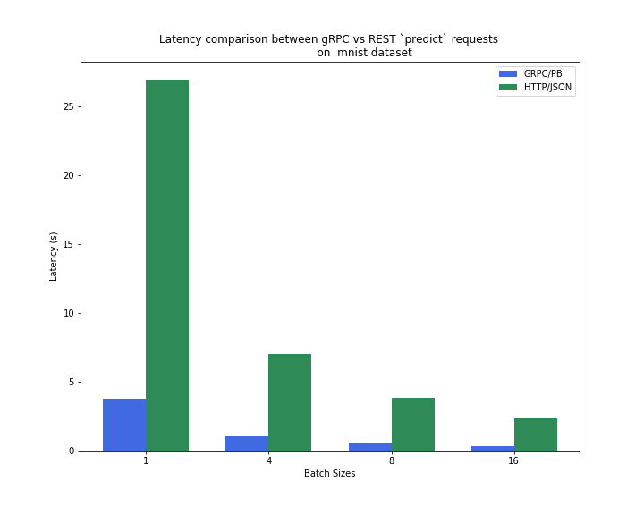

# Simple TensorFlow Serving Client

A simple, consolidated, extensible [gRPC](https://grpc.io/)-based client implementation for querying a hosted `tensorflow_model_server`.

**What it does do?**

It simplifies working with [protocol buffers](https://developers.google.com/protocol-buffers/) and provides custom functions for working with `protobuf` APIs (i.e. messages and services) inside [Tensorflow Serving](https://www.tensorflow.org/tfx/guide/serving) , all without leaving the comfort of python. 

Implements gRPC client stubs for `GetModelMetadata`, `GetModelStatus`, `HandleReloadConfig` and `Predict` APIs. 

**What it doesn't do?**

It doesn't completely abstract away working with protocol buffers. The internal protocol buffer can still be accessed and manipulated using methods specific to protocol buffers. This is preferred when working with gRPC clients that expect raw protocol buffers.

For a more detailed reference, [click here](./docs/DESIGN.md).

## Installation

### Client

```bash
pip install git+https://github.com/jagans94/stfsclient.git
```

### `tensorflow_model_server` 

**Note:** Run as `sudo`; only works on Debian/Ubuntu

```bash
echo "deb http://storage.googleapis.com/tensorflow-serving-apt stable tensorflow-model-server tensorflow-model-server-universal" | tee /etc/apt/sources.list.d/tensorflow-serving.list && \
curl https://storage.googleapis.com/tensorflow-serving-apt/tensorflow-serving.release.pub.gpg | apt-key add -
apt update
apt-get install tensorflow-model-server
```

## Tutorial

Refer here for the most up-to-date [tutorial.](./extras/tutorial)

## Benchmarks

 

gRPC predict requests have a lot smaller latency profile (approx. 6 times faster) when compared with REST based requests on MNIST data set! :)

**Note:** Code for bench marking can be found at  [extras/benchmarks.](./extras/benchmarks)

## Contributions

Want to add a feature that's not in here or implement [one of these](./docs/TODO.md). Raise an **Issue** or better yet **PR**. ;)

## Copyright

Copyright 2019 onwards. Licensed under the MIT License; you may not use this project's files except in compliance with the License. A copy of the License is provided in the [LICENSE](./LICENSE) file in this repository.

